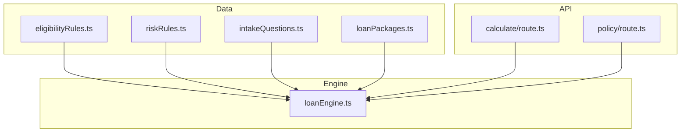
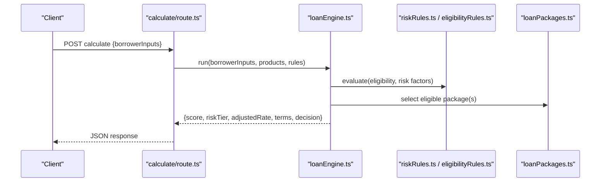
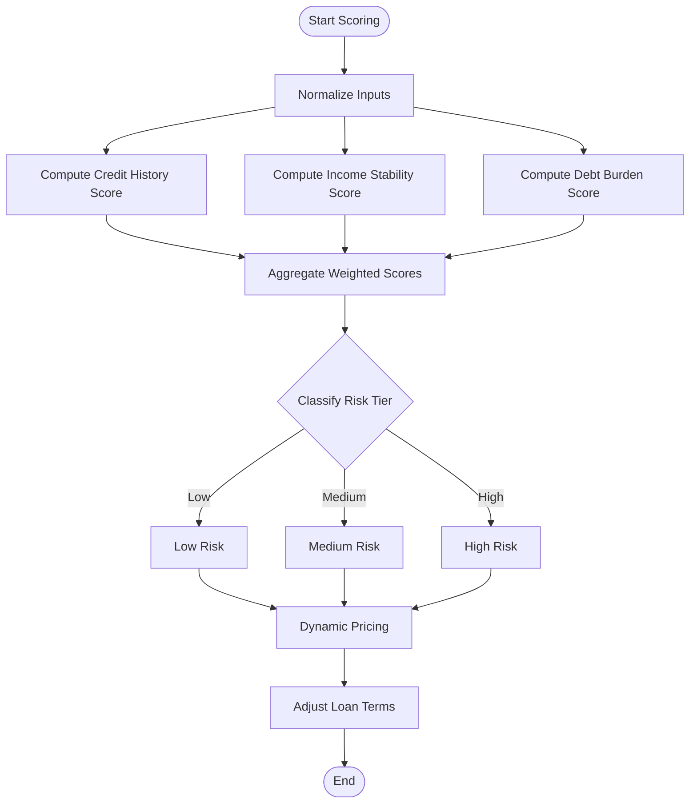
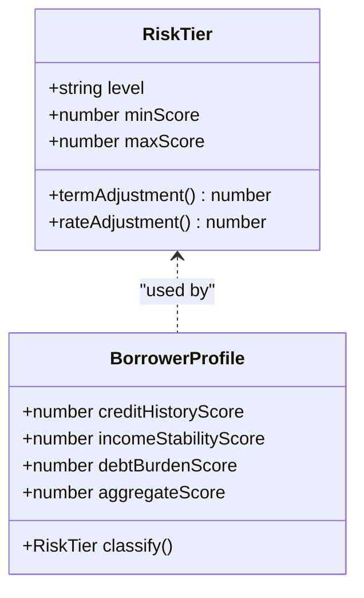
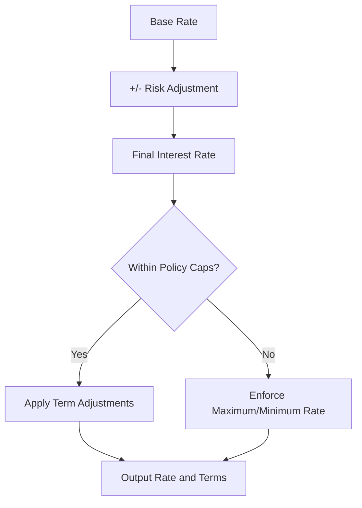
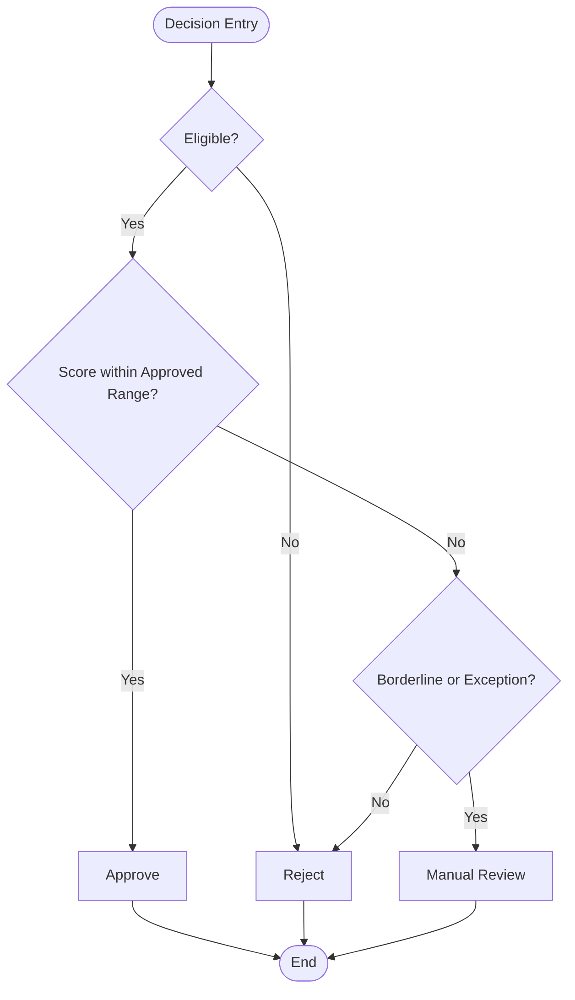
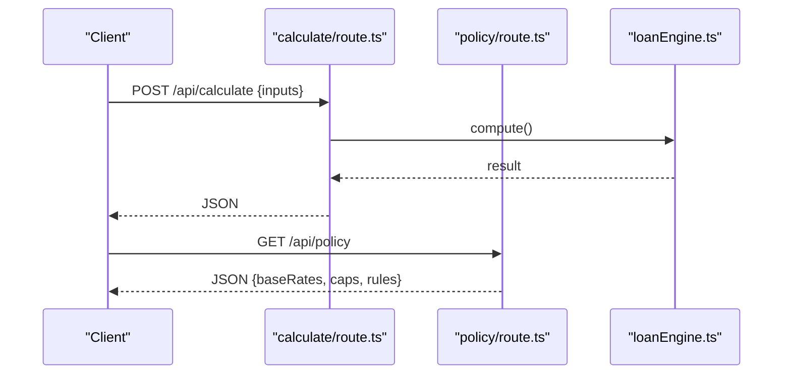
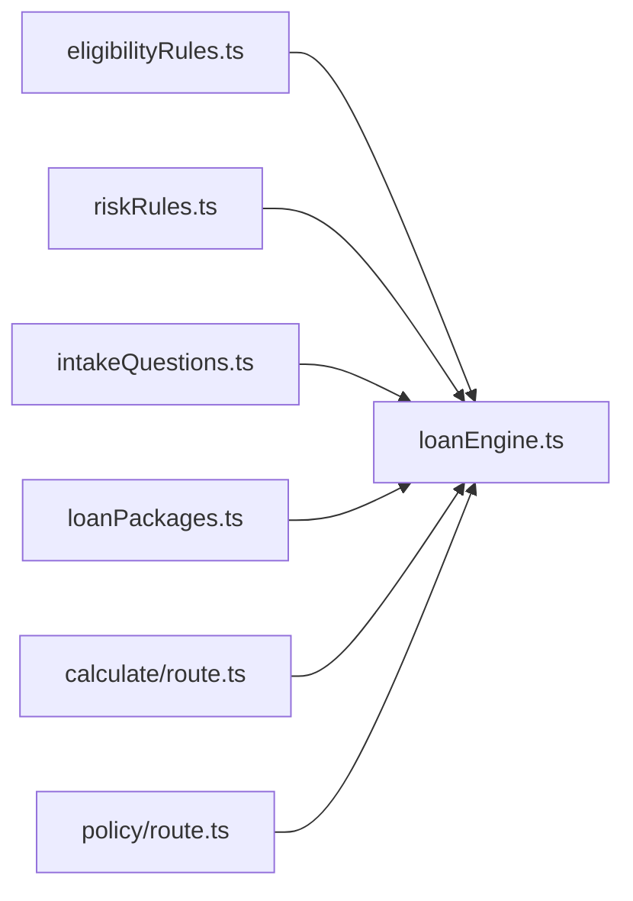

# Risk Assessment Algorithms

<cite>
**Referenced Files in This Document**
- [riskRules.ts](file://src/data/riskRules.ts)
- [eligibilityRules.ts](file://src/data/eligibilityRules.ts)
- [intakeQuestions.ts](file://src/data/intakeQuestions.ts)
- [loanPackages.ts](file://src/data/loanPackages.ts)
- [calculate/route.ts](file://src/app/api/calculate/route.ts)
- [policy/route.ts](file://src/app/api/policy/route.ts)
- [loanEngine.ts](file://src/lib/loanEngine.ts)
</cite>

## Table of Contents
1. [Introduction](#introduction)
2. [Project Structure](#project-structure)
3. [Core Components](#core-components)
4. [Architecture Overview](#architecture-overview)
5. [Detailed Component Analysis](#detailed-component-analysis)
6. [Dependency Analysis](#dependency-analysis)
7. [Performance Considerations](#performance-considerations)
8. [Troubleshooting Guide](#troubleshooting-guide)
9. [Conclusion](#conclusion)
10. [Appendices](#appendices)

## Introduction
This document explains the risk assessment algorithms used to evaluate borrower creditworthiness and determine loan terms. It covers scoring models for credit history analysis, income stability evaluation, and debt burden assessment; the risk classification system that assigns borrowers to low, medium, or high risk tiers with corresponding loan term adjustments; dynamic pricing algorithms that adjust interest rates based on risk profiles; decision tree logic for automated approval/rejection and manual review triggers; and model validation, backtesting procedures, and regulatory compliance considerations for fair lending practices.

## Project Structure
The risk assessment functionality is implemented across data definitions, API routes, and a core engine:
- Data definitions define eligibility rules, risk rules, intake questions, and loan packages.
- API routes expose endpoints for calculating scores/terms and retrieving policy configuration.
- The loan engine orchestrates rule evaluation, scoring, and decisioning.

**Diagram sources**
- [eligibilityRules.ts](file://src/data/eligibilityRules.ts)
- [riskRules.ts](file://src/data/riskRules.ts)
- [intakeQuestions.ts](file://src/data/intakeQuestions.ts)
- [loanPackages.ts](file://src/data/loanPackages.ts)
- [calculate/route.ts](file://src/app/api/calculate/route.ts)
- [policy/route.ts](file://src/app/api/policy/route.ts)
- [loanEngine.ts](file://src/lib/loanEngine.ts)

**Section sources**
- [eligibilityRules.ts](file://src/data/eligibilityRules.ts)
- [riskRules.ts](file://src/data/riskRules.ts)
- [intakeQuestions.ts](file://src/data/intakeQuestions.ts)
- [loanPackages.ts](file://src/data/loanPackages.ts)
- [calculate/route.ts](file://src/app/api/calculate/route.ts)
- [policy/route.ts](file://src/app/api/policy/route.ts)
- [loanEngine.ts](file://src/lib/loanEngine.ts)

## Core Components
- Eligibility Rules: Define minimum criteria for product consideration (e.g., age, residency, employment type).
- Risk Rules: Encode scoring factors and thresholds for credit history, income stability, and debt burden.
- Intake Questions: Capture borrower inputs required for scoring and underwriting decisions.
- Loan Packages: Specify available products, maximum amounts, tenors, and base rate parameters.
- API Routes: Expose calculation and policy endpoints that orchestrate engine execution.
- Loan Engine: Central logic that evaluates rules, computes scores, classifies risk, and determines terms.

Key responsibilities:
- Input normalization and validation against intake schema.
- Scoring computation using weighted factors from risk rules.
- Risk tier assignment (low, medium, high) with associated term adjustments.
- Dynamic pricing via base rate plus risk-based adjustments.
- Decision outcomes: approve, reject, or flag for manual review.

**Section sources**
- [eligibilityRules.ts](file://src/data/eligibilityRules.ts)
- [riskRules.ts](file://src/data/riskRules.ts)
- [intakeQuestions.ts](file://src/data/intakeQuestions.ts)
- [loanPackages.ts](file://src/data/loanPackages.ts)
- [loanEngine.ts](file://src/lib/loanEngine.ts)

## Architecture Overview
The system follows a layered architecture:
- Data Layer: Static configurations for rules, questions, and products.
- API Layer: HTTP endpoints for client interactions.
- Engine Layer: Deterministic scoring and decisioning logic.

**Diagram sources**
- [calculate/route.ts](file://src/app/api/calculate/route.ts)
- [loanEngine.ts](file://src/lib/loanEngine.ts)
- [riskRules.ts](file://src/data/riskRules.ts)
- [eligibilityRules.ts](file://src/data/eligibilityRules.ts)
- [loanPackages.ts](file://src/data/loanPackages.ts)

## Detailed Component Analysis

### Scoring Models
Scoring combines three primary dimensions:
- Credit History Analysis: Evaluates past repayment behavior, delinquencies, and credit utilization trends.
- Income Stability Evaluation: Assesses employment continuity, income volatility, and consistency of earnings.
- Debt Burden Assessment: Computes debt-to-income ratios, existing obligations, and capacity for additional debt.

Each dimension contributes a weighted score derived from risk rules. The engine aggregates these into an overall risk score used for classification and pricing.

**Diagram sources**
- [riskRules.ts](file://src/data/riskRules.ts)
- [loanEngine.ts](file://src/lib/loanEngine.ts)

**Section sources**
- [riskRules.ts](file://src/data/riskRules.ts)
- [loanEngine.ts](file://src/lib/loanEngine.ts)

### Risk Classification System
Borrowers are categorized into risk tiers:
- Low Risk: Favorable credit history, stable income, manageable debt burden.
- Medium Risk: Mixed indicators requiring moderate adjustments.
- High Risk: Adverse signals prompting stricter terms or rejection.

Tier assignment influences both loan term adjustments and interest rate adjustments.

**Diagram sources**
- [riskRules.ts](file://src/data/riskRules.ts)
- [loanEngine.ts](file://src/lib/loanEngine.ts)

**Section sources**
- [riskRules.ts](file://src/data/riskRules.ts)
- [loanEngine.ts](file://src/lib/loanEngine.ts)

### Dynamic Pricing Algorithms
Interest rates are determined by combining a base rate with risk-based adjustments:
- Base Rate: Derived from market conditions and product configuration.
- Risk Adjustment: Positive or negative adjustment based on risk tier and specific borrower attributes.
- Term Adjustments: Tenor and amount limits may be modified per risk tier.

**Diagram sources**
- [loanPackages.ts](file://src/data/loanPackages.ts)
- [riskRules.ts](file://src/data/riskRules.ts)
- [loanEngine.ts](file://src/lib/loanEngine.ts)

**Section sources**
- [loanPackages.ts](file://src/data/loanPackages.ts)
- [riskRules.ts](file://src/data/riskRules.ts)
- [loanEngine.ts](file://src/lib/loanEngine.ts)

### Decision Tree Logic
Automated decisions follow a deterministic flow:
- Eligibility Gate: Reject if minimum criteria not met.
- Score Thresholds: Approve, reject, or route to manual review based on score ranges.
- Manual Review Triggers: Flag borderline cases or exceptional circumstances for human evaluation.

**Diagram sources**
- [eligibilityRules.ts](file://src/data/eligibilityRules.ts)
- [riskRules.ts](file://src/data/riskRules.ts)
- [loanEngine.ts](file://src/lib/loanEngine.ts)

**Section sources**
- [eligibilityRules.ts](file://src/data/eligibilityRules.ts)
- [riskRules.ts](file://src/data/riskRules.ts)
- [loanEngine.ts](file://src/lib/loanEngine.ts)

### API Endpoints
- Calculate Endpoint: Accepts borrower inputs and returns scoring, risk tier, adjusted rate, terms, and decision.
- Policy Endpoint: Returns current policy configuration including base rates, caps, and rule versions.

**Diagram sources**
- [calculate/route.ts](file://src/app/api/calculate/route.ts)
- [policy/route.ts](file://src/app/api/policy/route.ts)
- [loanEngine.ts](file://src/lib/loanEngine.ts)

**Section sources**
- [calculate/route.ts](file://src/app/api/calculate/route.ts)
- [policy/route.ts](file://src/app/api/policy/route.ts)
- [loanEngine.ts](file://src/lib/loanEngine.ts)

## Dependency Analysis
The engine depends on static rule sets and product configurations. API routes depend on the engine to produce results.

**Diagram sources**
- [eligibilityRules.ts](file://src/data/eligibilityRules.ts)
- [riskRules.ts](file://src/data/riskRules.ts)
- [intakeQuestions.ts](file://src/data/intakeQuestions.ts)
- [loanPackages.ts](file://src/data/loanPackages.ts)
- [calculate/route.ts](file://src/app/api/calculate/route.ts)
- [policy/route.ts](file://src/app/api/policy/route.ts)
- [loanEngine.ts](file://src/lib/loanEngine.ts)

**Section sources**
- [eligibilityRules.ts](file://src/data/eligibilityRules.ts)
- [riskRules.ts](file://src/data/riskRules.ts)
- [intakeQuestions.ts](file://src/data/intakeQuestions.ts)
- [loanPackages.ts](file://src/data/loanPackages.ts)
- [calculate/route.ts](file://src/app/api/calculate/route.ts)
- [policy/route.ts](file://src/app/api/policy/route.ts)
- [loanEngine.ts](file://src/lib/loanEngine.ts)

## Performance Considerations
- Rule Evaluation Efficiency: Keep risk rules and eligibility checks declarative and vectorized where possible to minimize branching overhead.
- Caching Policies: Cache policy responses and base rates to reduce repeated computations.
- Input Validation: Fail fast on invalid inputs to avoid unnecessary processing.
- Batch Processing: For bulk applications, batch scoring calls to amortize overhead.

[No sources needed since this section provides general guidance]

## Troubleshooting Guide
Common issues and resolutions:
- Invalid Inputs: Ensure all required fields from intake questions are present and valid.
- Policy Misconfiguration: Verify base rates, caps, and rule versions via the policy endpoint.
- Unexpected Rejections: Check eligibility gates and score thresholds; confirm risk rule weights.
- Manual Review Overload: Tune borderline thresholds to balance automation and review workload.

**Section sources**
- [intakeQuestions.ts](file://src/data/intakeQuestions.ts)
- [policy/route.ts](file://src/app/api/policy/route.ts)
- [riskRules.ts](file://src/data/riskRules.ts)
- [eligibilityRules.ts](file://src/data/eligibilityRules.ts)

## Conclusion
The risk assessment system integrates structured data rules with a deterministic engine to compute borrower scores, classify risk, and dynamically price loans. Clear decision trees enable automated approvals and targeted manual reviews. Ongoing model validation, backtesting, and adherence to fair lending regulations ensure responsible and compliant lending practices.

[No sources needed since this section summarizes without analyzing specific files]

## Appendices

### Model Validation and Backtesting Procedures
- Validation Strategy:
  - Out-of-sample testing on historical datasets.
  - Stress testing under adverse economic scenarios.
  - Calibration of thresholds to maintain target default rates.
- Backtesting:
  - Compare predicted vs actual outcomes over time.
  - Monitor drift in feature distributions and performance metrics.
- Fair Lending Compliance:
  - Disparate impact analysis across protected classes.
  - Explainability requirements for adverse actions.
  - Audit trails for decisions and model versions.

[No sources needed since this section provides general guidance]