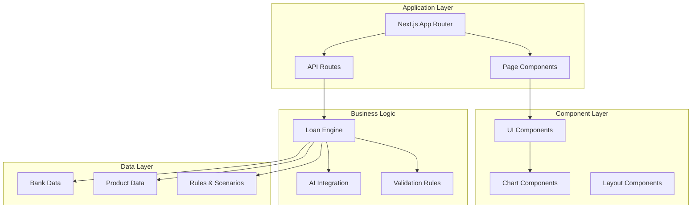
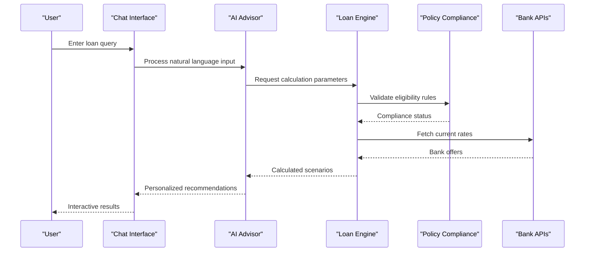
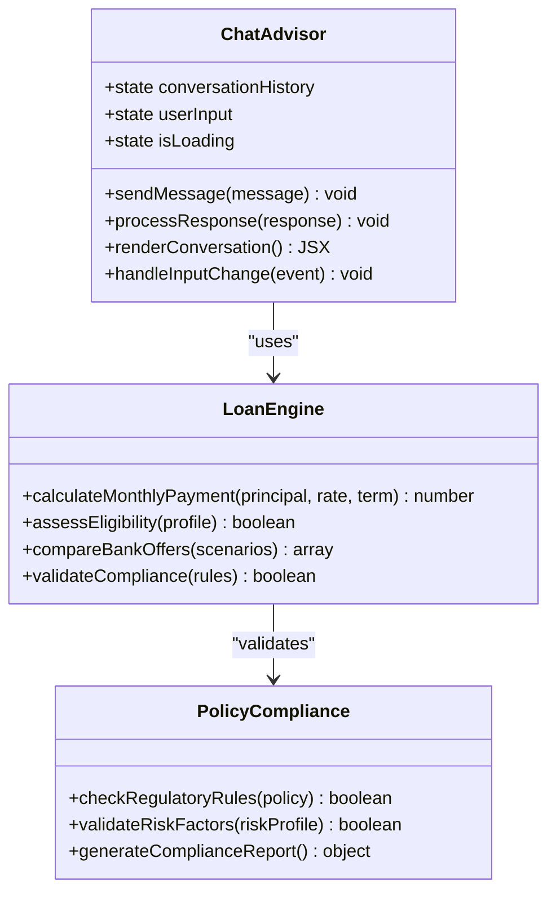
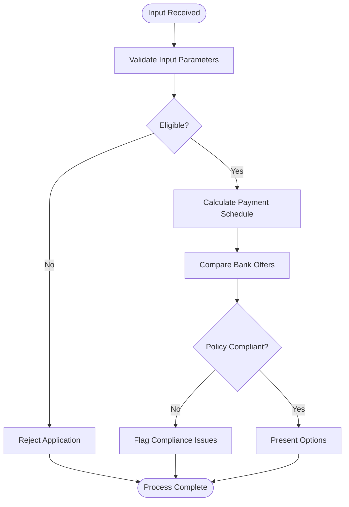
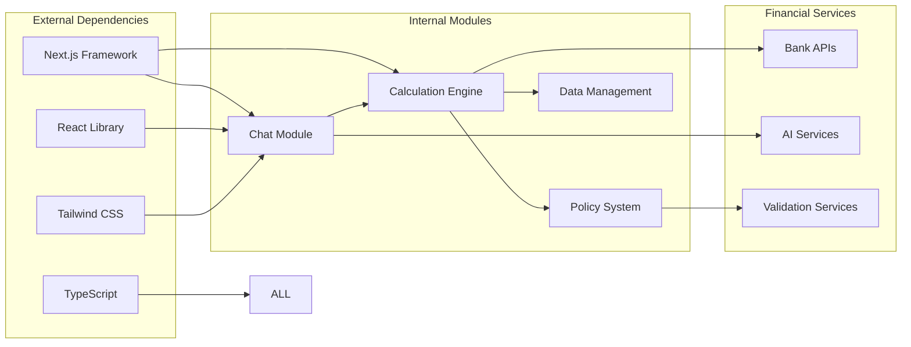

# Project Overview

<cite>
**Referenced Files in This Document**
- [README.md](file://README.md)
- [package.json](file://package.json)
- [next.config.mjs](file://next.config.mjs)
- [src/app/layout.tsx](file://src/app/layout.tsx)
- [src/app/page.tsx](file://src/app/page.tsx)
- [src/components/ChatAdvisor.tsx](file://src/components/ChatAdvisor.tsx)
- [src/lib/loanEngine.ts](file://src/lib/loanEngine.ts)
- [src/data/eligibilityRules.ts](file://src/data/eligibilityRules.ts)
- [src/data/riskRules.ts](file://src/data/riskRules.ts)
- [src/app/api/calculate/route.ts](file://src/app/api/calculate/route.ts)
- [src/app/api/chat/route.ts](file://src/app/api/chat/route.ts)
- [src/app/api/policy/route.ts](file://src/app/api/policy/route.ts)
</cite>

## Table of Contents
1. [Introduction](#introduction)
2. [Project Structure](#project-structure)
3. [Core Components](#core-components)
4. [Architecture Overview](#architecture-overview)
5. [Detailed Component Analysis](#detailed-component-analysis)
6. [Dependency Analysis](#dependency-analysis)
7. [Performance Considerations](#performance-considerations)
8. [Troubleshooting Guide](#troubleshooting-guide)
9. [Conclusion](#conclusion)

## Introduction

Frontend-vaya is an AI-powered loan advisor application built with Next.js, designed to revolutionize how users interact with financial services. This fintech platform provides intelligent loan recommendations, multi-bank comparison capabilities, and real-time calculations through an intuitive chat interface. The application serves as a comprehensive financial consultation system that leverages artificial intelligence to guide users through complex loan decisions while ensuring policy compliance and regulatory adherence.

The platform's primary purpose is to democratize access to financial expertise by providing personalized loan advice, comparing offers from multiple banks, and delivering transparent calculations in real-time. Users can engage in natural conversations with the AI advisor to understand their eligibility, explore different loan scenarios, and make informed financial decisions.

## Project Structure

The frontend-vaya application follows a modern Next.js architecture with a component-based structure that promotes modularity and maintainability. The project is organized into several key directories:

**Diagram sources**
- [src/app/layout.tsx:1-50](file://src/app/layout.tsx#L1-L50)
- [src/components/ChatAdvisor.tsx:1-100](file://src/components/ChatAdvisor.tsx#L1-L100)
- [src/lib/loanEngine.ts:1-100](file://src/lib/loanEngine.ts#L1-L100)

The architecture emphasizes separation of concerns with clear boundaries between presentation, business logic, and data management layers.

**Section sources**
- [src/app/layout.tsx:1-50](file://src/app/layout.tsx#L1-L50)
- [package.json:1-50](file://package.json#L1-L50)

## Core Components

The frontend-vaya application is built around several core components that work together to provide a seamless user experience:

### Chat Advisor Interface
The central interaction point is the AI-powered chat interface that allows users to consult about loans naturally. This component handles conversation flow, processes user queries, and delivers contextual responses based on the user's financial profile and preferences.

### Loan Calculation Engine
The loan engine serves as the computational heart of the application, processing complex financial calculations including interest rates, amortization schedules, and eligibility assessments. It integrates with multiple bank APIs to provide real-time comparisons.

### Policy Compliance System
This system ensures all loan recommendations comply with regulatory requirements and institutional policies. It validates loan scenarios against established rules and flags potential compliance issues before presenting options to users.

### Data Visualization Components
Advanced charting components provide visual representations of loan scenarios, payment schedules, and comparative analysis across different banking institutions.

**Section sources**
- [src/components/ChatAdvisor.tsx:1-100](file://src/components/ChatAdvisor.tsx#L1-L100)
- [src/lib/loanEngine.ts:1-100](file://src/lib/loanEngine.ts#L1-L100)
- [src/data/eligibilityRules.ts:1-50](file://src/data/eligibilityRules.ts#L1-L50)

## Architecture Overview

The frontend-vaya application implements a sophisticated architecture that combines client-side rendering with server-side processing for optimal performance and user experience.

**Diagram sources**
- [src/app/api/chat/route.ts:1-100](file://src/app/api/chat/route.ts#L1-L100)
- [src/lib/loanEngine.ts:1-100](file://src/lib/loanEngine.ts#L1-L100)
- [src/app/api/calculate/route.ts:1-100](file://src/app/api/calculate/route.ts#L1-L100)

The architecture follows a layered approach where the presentation layer communicates with business logic through well-defined API endpoints, ensuring scalability and maintainability.

## Detailed Component Analysis

### Chat Advisor Component
The ChatAdvisor component serves as the primary user interface for loan consultations. It manages conversation state, processes user inputs, and renders contextual responses with relevant financial data.

**Diagram sources**
- [src/components/ChatAdvisor.tsx:1-100](file://src/components/ChatAdvisor.tsx#L1-L100)
- [src/lib/loanEngine.ts:1-100](file://src/lib/loanEngine.ts#L1-L100)

### Loan Calculation Engine
The loan engine implements sophisticated financial algorithms to process loan scenarios, calculate payments, and assess eligibility across multiple banking institutions.

**Diagram sources**
- [src/lib/loanEngine.ts:1-100](file://src/lib/loanEngine.ts#L1-L100)
- [src/data/eligibilityRules.ts:1-50](file://src/data/eligibilityRules.ts#L1-L50)

### API Route Handlers
The application exposes RESTful API endpoints for handling financial calculations, chat interactions, and policy validation requests.

**Section sources**
- [src/app/api/calculate/route.ts:1-100](file://src/app/api/calculate/route.ts#L1-L100)
- [src/app/api/chat/route.ts:1-100](file://src/app/api/chat/route.ts#L1-L100)
- [src/app/api/policy/route.ts:1-100](file://src/app/api/policy/route.ts#L1-L100)

## Dependency Analysis

The frontend-vaya application maintains clean dependencies between components and external services:

**Diagram sources**
- [package.json:1-100](file://package.json#L1-L100)
- [src/lib/loanEngine.ts:1-100](file://src/lib/loanEngine.ts#L1-L100)

The dependency structure ensures loose coupling between modules while maintaining strong interfaces for data exchange and service communication.

**Section sources**
- [package.json:1-100](file://package.json#L1-L100)
- [next.config.mjs:1-50](file://next.config.mjs#L1-L50)

## Performance Considerations

The frontend-vaya application implements several performance optimization strategies:

- **Server-Side Rendering (SSR)**: Critical pages are rendered on the server to improve initial load times and SEO performance
- **Component Lazy Loading**: Heavy components like charts and data visualizations are loaded on-demand
- **Caching Strategies**: Financial calculations and bank rates are cached to reduce API calls
- **Optimized State Management**: Local state is minimized while global state uses efficient patterns
- **Bundle Optimization**: Code splitting and tree shaking minimize JavaScript bundle size

## Troubleshooting Guide

Common issues and their solutions in the frontend-vaya application:

### Chat Interface Issues
- **Connection Problems**: Verify API endpoint availability and network connectivity
- **Response Delays**: Check AI service response times and implement timeout handlers
- **State Synchronization**: Ensure proper state updates and cleanup of event listeners

### Calculation Engine Errors
- **Invalid Inputs**: Implement robust input validation and error messages
- **Rate Limiting**: Handle API rate limits with exponential backoff strategies
- **Data Consistency**: Validate data formats and handle missing fields gracefully

### Policy Compliance Failures
- **Rule Updates**: Keep policy rules synchronized with regulatory changes
- **Edge Cases**: Test boundary conditions and unusual financial scenarios
- **Audit Trails**: Maintain logs for compliance verification and debugging

**Section sources**
- [src/app/api/chat/route.ts:1-100](file://src/app/api/chat/route.ts#L1-L100)
- [src/lib/loanEngine.ts:1-100](file://src/lib/loanEngine.ts#L1-L100)

## Conclusion

Frontend-vaya represents a sophisticated approach to financial technology, combining AI-powered assistance with robust calculation engines and strict policy compliance. The application's modular architecture enables easy maintenance and scaling while providing users with an intuitive interface for navigating complex loan decisions.

The platform successfully bridges the gap between traditional banking services and modern digital expectations, offering personalized financial guidance that adapts to individual user needs and circumstances. Through its innovative use of AI and real-time data processing, frontend-vaya sets a new standard for loan advisory applications in the fintech space.

Future enhancements may include expanded bank integrations, advanced predictive analytics, and enhanced mobile responsiveness to further improve the user experience and expand market reach.