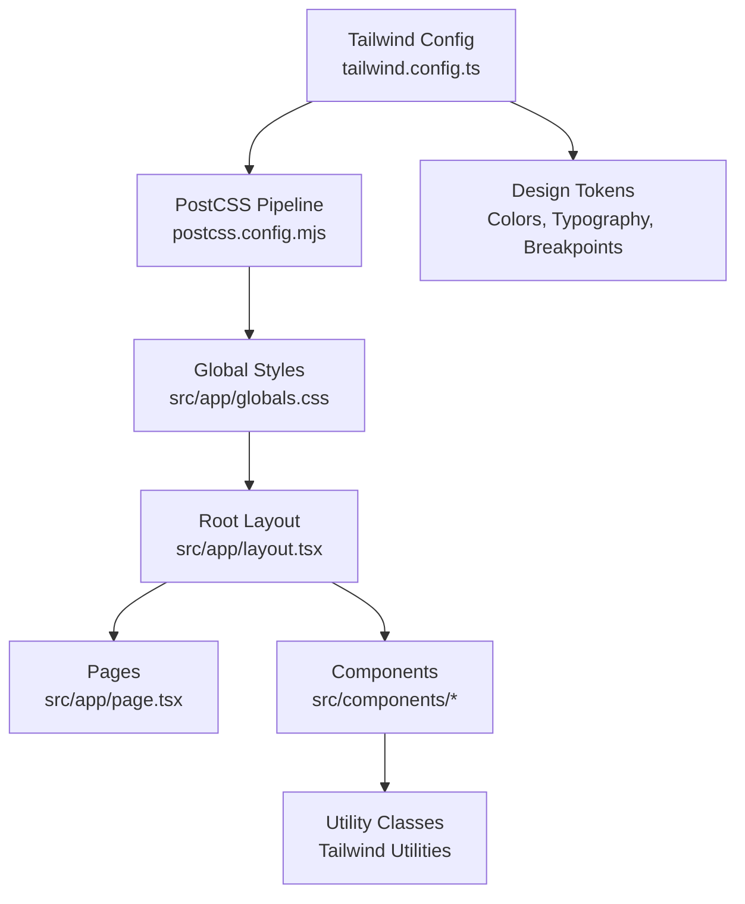
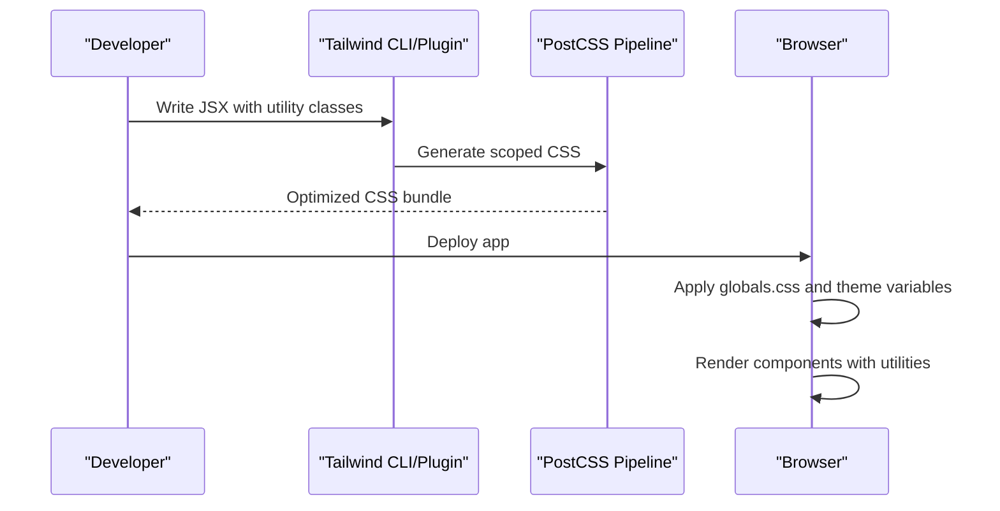
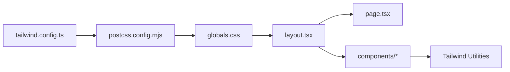

# Styling and Theming

<cite>
**Referenced Files in This Document**
- [tailwind.config.ts](file://tailwind.config.ts)
- [postcss.config.mjs](file://postcss.config.mjs)
- [globals.css](file://src/app/globals.css)
- [layout.tsx](file://src/app/layout.tsx)
- [page.tsx](file://src/app/page.tsx)
- [Navbar.tsx](file://src/components/Navbar.tsx)
- [Hero.tsx](file://src/components/Hero.tsx)
- [Footer.tsx](file://src/components/Footer.tsx)
- [package.json](file://package.json)
</cite>

## Table of Contents
1. [Introduction](#introduction)
2. [Project Structure](#project-structure)
3. [Core Components](#core-components)
4. [Architecture Overview](#architecture-overview)
5. [Detailed Component Analysis](#detailed-component-analysis)
6. [Dependency Analysis](#dependency-analysis)
7. [Performance Considerations](#performance-considerations)
8. [Troubleshooting Guide](#troubleshooting-guide)
9. [Conclusion](#conclusion)
10. [Appendices](#appendices)

## Introduction
This document explains the styling and theming system used in the frontend-vaya application. It covers Tailwind CSS configuration, global CSS structure, utility class organization, component-specific styling patterns, and the approach to theming for visual modes and brand variations. It also includes guidance on responsive design, accessibility, PostCSS pipeline configuration, build-time optimizations, and best practices for maintaining style consistency and managing design tokens.

## Project Structure
The styling-related files are organized as follows:
- Tailwind configuration defines custom colors, typography, breakpoints, and plugins.
- PostCSS configuration wires Tailwind and other processing steps.
- Global styles live under the app directory and are applied at the root layout.
- Components use Tailwind utility classes consistently; some components may include small inline style blocks or theme-aware logic.

**Diagram sources**
- [tailwind.config.ts](file://tailwind.config.ts)
- [postcss.config.mjs](file://postcss.config.mjs)
- [globals.css](file://src/app/globals.css)
- [layout.tsx](file://src/app/layout.tsx)
- [page.tsx](file://src/app/page.tsx)

**Section sources**
- [tailwind.config.ts](file://tailwind.config.ts)
- [postcss.config.mjs](file://postcss.config.mjs)
- [globals.css](file://src/app/globals.css)
- [layout.tsx](file://src/app/layout.tsx)
- [page.tsx](file://src/app/page.tsx)

## Core Components
- Tailwind Configuration: Centralizes design tokens such as color palettes, typography scales, spacing, shadows, and breakpoints. Plugins can extend functionality like forms, animations, or container queries.
- PostCSS Pipeline: Orchestrates CSS processing, including Tailwind’s scanning and purging, autoprefixing, and minification.
- Global CSS: Establishes base styles, CSS variables for theming, and shared utilities.
- Root Layout: Injects global styles into the page tree and sets up any theme providers or context.
- Components: Use Tailwind utilities for layout, spacing, typography, and state-driven styling (hover, focus, dark mode variants).

Key responsibilities:
- Design tokens and scale definitions live in the Tailwind config.
- Theme variables and base resets live in global CSS.
- Components remain declarative with utility classes, avoiding heavy custom CSS.

**Section sources**
- [tailwind.config.ts](file://tailwind.config.ts)
- [postcss.config.mjs](file://postcss.config.mjs)
- [globals.css](file://src/app/globals.css)
- [layout.tsx](file://src/app/layout.tsx)

## Architecture Overview
The styling architecture is a layered pipeline:
- Build time: Tailwind scans source files, generates utility classes based on usage, and outputs optimized CSS via PostCSS.
- Runtime: Global CSS applies base styles and theme variables; components consume utilities and theme-aware variants.

**Diagram sources**
- [postcss.config.mjs](file://postcss.config.mjs)
- [tailwind.config.ts](file://tailwind.config.ts)
- [globals.css](file://src/app/globals.css)

## Detailed Component Analysis

### Tailwind Configuration
- Custom color palette: Define semantic colors (e.g., primary, secondary, neutral, accent) to ensure brand consistency across components.
- Typography scale: Configure font families, sizes, line heights, and weights for consistent text hierarchy.
- Responsive breakpoints: Extend or customize breakpoints to match design requirements and device targets.
- Plugins: Enable features like forms, aspect-ratio, or container queries if needed.

Best practices:
- Keep token names semantic and avoid ad-hoc hex values in components.
- Group related tokens logically (colors, fonts, spacing, shadows).
- Document new tokens and their intended usage.

**Section sources**
- [tailwind.config.ts](file://tailwind.config.ts)

### PostCSS Pipeline
- Plugins: Typically includes Tailwind CSS, Autoprefixer, and optionally CSSNano or other optimizers.
- Scanning: Tailwind scans source files to extract used utilities and purge unused CSS.
- Optimization: Minification and prefixing ensure cross-browser compatibility and smaller bundles.

Guidelines:
- Ensure all source paths are included in Tailwind’s content scanning to avoid missing utilities.
- Avoid disabling critical optimization steps unless debugging specific issues.

**Section sources**
- [postcss.config.mjs](file://postcss.config.mjs)
- [package.json](file://package.json)

### Global CSS Structure
- Base styles: Reset or normalize browser defaults, define body background, and set default text rendering.
- Theme variables: Define CSS custom properties for light/dark themes, brand colors, and spacing tokens.
- Utility classes: Add small reusable helpers when Tailwind utilities are insufficient.

Accessibility considerations:
- Ensure sufficient contrast ratios for text and interactive elements.
- Provide focus indicators and keyboard navigation support.
- Use semantic HTML and ARIA attributes where necessary.

**Section sources**
- [globals.css](file://src/app/globals.css)

### Root Layout and Page Integration
- The root layout imports global styles and ensures they apply across the app.
- Pages compose components that rely on Tailwind utilities and theme variables.

Implementation notes:
- Keep layout minimal; avoid heavy inline styles.
- If using a theme provider, initialize it before rendering pages.

**Section sources**
- [layout.tsx](file://src/app/layout.tsx)
- [page.tsx](file://src/app/page.tsx)

### Component Styling Patterns
- Navbar, Hero, Footer, and other components primarily use Tailwind utilities for layout, spacing, typography, and state variants.
- Prefer utility composition over custom CSS to maintain consistency and enable purging.
- For dynamic behavior (e.g., hover, focus, active), leverage Tailwind’s variant modifiers.

Example references:
- Navigation bar styling and responsive behavior.
- Hero section layout and typography.
- Footer structure and spacing.

**Section sources**
- [Navbar.tsx](file://src/components/Navbar.tsx)
- [Hero.tsx](file://src/components/Hero.tsx)
- [Footer.tsx](file://src/components/Footer.tsx)

### Theming Approach
- Light/Dark Mode: Use CSS variables and Tailwind’s dark mode strategy (class-based or media query) to toggle themes.
- Brand Variations: Define multiple color palettes in Tailwind config and switch via a theme context or class on the root element.
- Accessibility: Ensure WCAG contrast guidelines are met in both light and dark modes; test with color blindness simulators.

Workflow:
- Define tokens in Tailwind config and CSS variables.
- Apply theme-aware classes conditionally based on user preference or system settings.
- Validate contrast and readability across modes.

**Section sources**
- [globals.css](file://src/app/globals.css)
- [tailwind.config.ts](file://tailwind.config.ts)

## Dependency Analysis
Styling dependencies flow from configuration to runtime:
- Tailwind config defines tokens and extensions.
- PostCSS processes CSS through configured plugins.
- Global CSS applies base styles and theme variables.
- Components consume utilities and theme variables.

**Diagram sources**
- [tailwind.config.ts](file://tailwind.config.ts)
- [postcss.config.mjs](file://postcss.config.mjs)
- [globals.css](file://src/app/globals.css)
- [layout.tsx](file://src/app/layout.tsx)
- [page.tsx](file://src/app/page.tsx)

**Section sources**
- [tailwind.config.ts](file://tailwind.config.ts)
- [postcss.config.mjs](file://postcss.config.mjs)
- [globals.css](file://src/app/globals.css)
- [layout.tsx](file://src/app/layout.tsx)
- [page.tsx](file://src/app/page.tsx)

## Performance Considerations
- Purge Unused CSS: Rely on Tailwind’s scanning to remove unused utilities; ensure content paths include all relevant files.
- Minify CSS: Enable CSS minification in PostCSS to reduce bundle size.
- Avoid Heavy Custom CSS: Prefer Tailwind utilities to keep the stylesheet lean and predictable.
- Lazy Load Non-Critical Styles: Defer non-essential styles if necessary to improve initial load performance.
- Monitor Bundle Size: Use build tools to analyze CSS output and identify opportunities for reduction.

[No sources needed since this section provides general guidance]

## Troubleshooting Guide
Common issues and resolutions:
- Missing Utilities: Verify Tailwind’s content scanning includes all directories and file types where utilities are used.
- Dark Mode Not Applying: Check the presence of the theme class on the root element and ensure CSS variables are correctly scoped.
- Contrast Failures: Adjust color tokens to meet WCAG contrast requirements; test with accessibility tools.
- Build Errors: Review PostCSS plugin order and configuration; ensure compatible versions of Tailwind and PostCSS.

Debugging tips:
- Inspect generated CSS to confirm utilities are present.
- Temporarily disable plugins to isolate issues.
- Use browser dev tools to verify theme variables and computed styles.

**Section sources**
- [postcss.config.mjs](file://postcss.config.mjs)
- [globals.css](file://src/app/globals.css)
- [tailwind.config.ts](file://tailwind.config.ts)

## Conclusion
The frontend-vaya styling and theming system leverages Tailwind CSS for consistent, utility-first styling, supported by a robust PostCSS pipeline for optimization. Global CSS establishes base styles and theme variables, while components remain declarative and accessible. By following the outlined best practices—semantic tokens, responsive design, accessibility checks, and build-time optimizations—the team can maintain a scalable, maintainable, and performant UI.

[No sources needed since this section summarizes without analyzing specific files]

## Appendices

### Best Practices Checklist
- Define semantic tokens in Tailwind config and CSS variables.
- Use Tailwind utilities exclusively for component styling.
- Implement dark mode with class-based toggling and validate contrast.
- Ensure content scanning paths cover all source files.
- Enable CSS minification and monitor bundle size.
- Test responsiveness across breakpoints and devices.
- Maintain accessibility standards (contrast, focus states, keyboard navigation).

[No sources needed since this section provides general guidance]