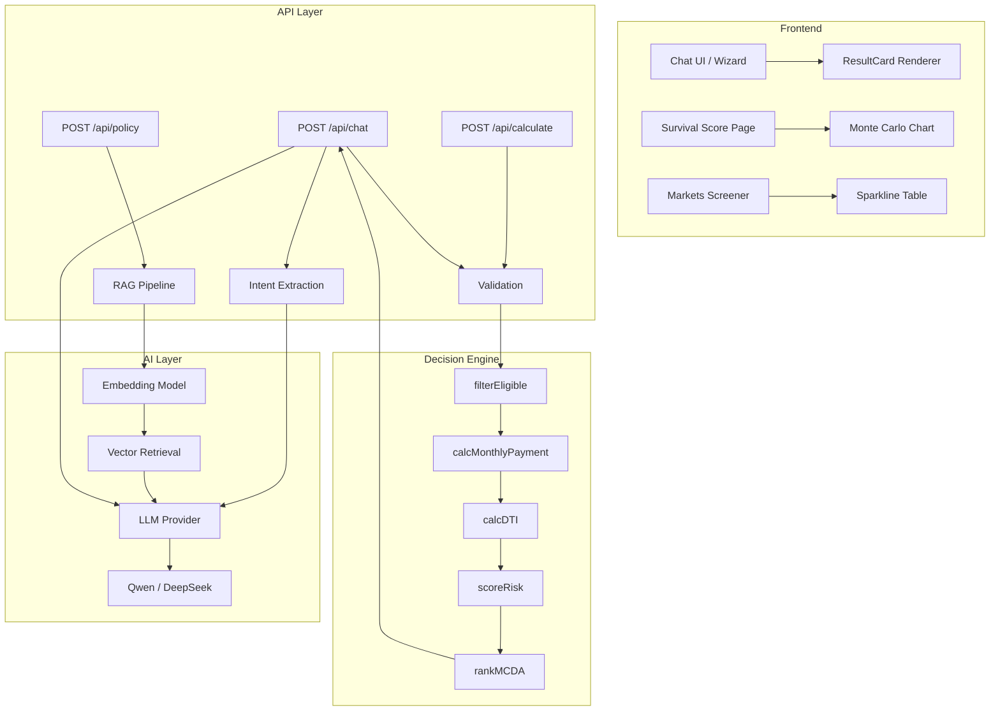
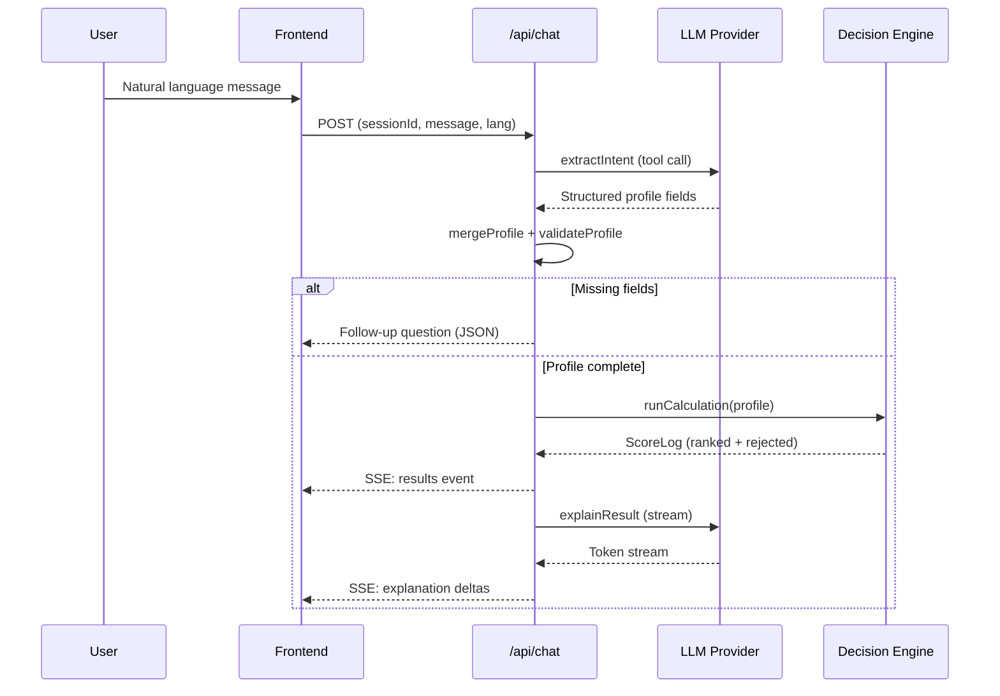

# Vaya — AI Loan Advisor for Vietnam

Vaya is a conversational AI loan advisor that compares official loan products across 20+ Vietnamese banks. Users describe their borrowing needs in natural language, and the system returns ranked recommendations with full financial transparency — monthly payments, DTI ratios, risk assessments, and cashflow survival analysis.

The platform combines a deterministic Decision Engine (pure computation, zero LLM involvement in scoring) with an AI narration layer (LLM-powered explanations, RAG-based policy Q&A) delivered over SSE streaming. All financial calculations are reproducible, auditable, and independent of model output.

**Target users:** Vietnamese consumers evaluating loan options across multiple banks.

**Core value proposition:** Unbiased, explainable loan comparisons powered by a rule-based engine — not by LLM hallucination.

---

## Table of Contents

- [Key Features](#key-features)
- [System Architecture](#system-architecture)
- [Technology Stack](#technology-stack)
- [Project Structure](#project-structure)
- [Application Workflow](#application-workflow)
- [AI Architecture](#ai-architecture)
- [Decision Engine](#decision-engine)
- [Survivability Analysis](#survivability-analysis)
- [API Documentation](#api-documentation)
- [Frontend Architecture](#frontend-architecture)
- [Configuration](#configuration)
- [Installation](#installation)
- [Deployment](#deployment)
- [Known Limitations](#known-limitations)
- [Contributing](#contributing)
- [License](#license)

---

## Key Features

### Financial Intelligence

The Decision Engine implements a multi-criteria decision analysis (MCDA) pipeline that filters, scores, and ranks loan packages using weighted-sum optimization. Every recommendation includes a transparent score breakdown across three dimensions: interest rate competitiveness, disbursement speed, and financial safety (DTI-based risk). The engine is 100% deterministic — identical inputs always produce identical outputs, making results fully auditable.

### AI Decision Support

The AI layer handles natural language understanding (intent extraction via structured tool calls), adaptive follow-up questioning, and result narration. The LLM never calculates, scores, ranks, or determines eligibility. It only extracts user intent from free text, explains pre-computed results in plain language, and answers policy questions via retrieval-augmented generation.

### Risk Assessment and Survivability

Two complementary risk engines assess loan affordability:

1. **Monte Carlo Cashflow Simulation** — Projects household savings balance over 60 months using 220 seeded random paths with income volatility and shock events. Produces percentile bands (P10/P50/P90), a stress-test line, and a ruin probability metric.

2. **4x4 Survivability Grid** — Cross-references 4 interest rate scenarios (base, rate drop, rate hike, stress) against 4 household shocks (none, job loss, income drop 30%, new child) to produce a score out of 16 with tier classification (ROBUST / ACCEPTABLE / FRAGILE / CRITICAL).

### Conversational Interface

A chat-first advisor collects borrowing requirements through a guided wizard (purpose, amount, term, age) with free-text parsing support. The conversation persists across page navigation via sessionStorage, and results render as interactive cards with amortization charts, payment comparisons, and cumulative interest visualizations.

### Policy Q&A (RAG)

A retrieval-augmented generation pipeline answers bank-specific policy questions (prepayment penalties, required documents, insurance conditions) by embedding queries, retrieving relevant document chunks via cosine similarity, and synthesizing cited answers through the LLM.

### Trilingual Support

Full internationalization across English, Vietnamese, and Chinese. The language switch re-renders all UI strings, API responses, chart labels, and LLM narration language in real time. Persisted to localStorage.

### Data Visualization

All charts are hand-written SVG components with zero external chart dependencies — line charts, sparklines, amortization curves, Monte Carlo band charts, and rate trend visualizations. Interactive tooltips display exact values on hover.

---

## System Architecture



### Request Lifecycle



---

## Technology Stack

| Category        | Technology                                                    |
| --------------- | ------------------------------------------------------------- |
| Framework       | Next.js 14 (App Router, Server Actions)                       |
| Language        | TypeScript 5.5 (strict mode)                                  |
| Runtime         | Node.js 18+                                                   |
| Styling         | Tailwind CSS 3.4 + CSS custom properties design system        |
| AI/LLM          | Alibaba Cloud DashScope (Qwen-Plus) via OpenAI-compatible SDK |
| Embeddings      | DashScope text-embedding-v3                                   |
| Validation      | Zod 4 (schema-first, trust boundary)                          |
| Streaming       | Server-Sent Events (native ReadableStream)                    |
| Charts          | Hand-written SVG (zero chart library dependencies)            |
| Fonts           | Sora (display) + Plus Jakarta Sans (body) + Noto Sans SC      |
| Deployment      | Vercel (serverless functions)                                 |
| Package Manager | npm / Bun (dual lockfile)                                     |

---

## Project Structure

```
src/
├── app/
│   ├── api/
│   │   ├── chat/route.ts        # Full advisory flow: intent → validation → engine → SSE
│   │   ├── calculate/route.ts   # Stateless deterministic calculation endpoint
│   │   └── policy/route.ts      # RAG policy Q&A endpoint
│   ├── analysis/page.tsx        # 4x4 survivability grid page
│   ├── chat/page.tsx            # Conversational advisor page
│   ├── checklist/page.tsx       # Document checklist generator
│   ├── package/[i]/page.tsx     # Individual package detail
│   ├── survival/page.tsx        # Monte Carlo cashflow simulation
│   ├── layout.tsx               # Root layout: fonts, I18nProvider, Navbar
│   ├── page.tsx                 # Home: hero → markets → why → how → testimonials
│   └── globals.css              # Full design system (light theme, square borders)
├── components/
│   ├── ChatAdvisor.tsx          # Conversational engine (state machine, SSE consumer)
│   ├── SurvivalScore.tsx        # Monte Carlo form + results + improvements
│   ├── AnalysisPage.tsx         # 4x4 grid + cliff detection + warnings
│   ├── ChecklistPage.tsx        # Purpose-based document checklist
│   ├── MarketsSection.tsx       # Fund-screener table with sparklines
│   ├── PackageDetail.tsx        # Single product deep-dive
│   ├── charts/
│   │   ├── SurvivalChart.tsx    # Interactive Monte Carlo band chart
│   │   ├── RateTrendChart.tsx   # 12-month rate trend with annotations
│   │   ├── LineChart.tsx        # Generic SVG line chart
│   │   └── Sparkline.tsx        # Inline trend sparkline
│   └── [Marketing components]   # Hero, Navbar, Footer, FAQ, CTA, etc.
├── data/
│   ├── banks.ts                 # BANKS, PKG (12 packages), AVG rate series
│   ├── loanPackages.ts          # Structured package records for Decision Engine
│   ├── eligibilityRules.ts      # Per-package eligibility constraints
│   ├── intakeQuestions.ts       # Adaptive follow-up question definitions
│   ├── checklists.ts            # Document requirements by purpose
│   ├── riskRules.ts             # Risk scoring thresholds
│   └── products/                # Detailed product models (rate schedules, tiers)
├── i18n/
│   ├── dict.ts                  # EN/VI/ZH dictionary (1100+ keys)
│   └── I18nProvider.tsx         # React context: lang, setLang, t()
├── lib/
│   ├── ai/
│   │   ├── provider.ts          # LLM provider abstraction (Qwen/DeepSeek)
│   │   ├── intent.ts            # Intent classification + profile merge
│   │   ├── questionEngine.ts    # Adaptive follow-up question logic
│   │   ├── prompts/             # System prompts (extractIntent, explainResult, policyAnswer)
│   │   └── rag/
│   │       ├── embed.ts         # DashScope embedding client
│   │       ├── retrieve.ts      # Cosine similarity top-K retrieval
│   │       └── store.ts         # In-memory chunk store with disk persistence
│   ├── engine/
│   │   ├── pipeline.ts          # Orchestrator: filter → payment → DTI → risk → MCDA
│   │   ├── filterEligible.ts    # Purpose/amount/term/income eligibility filter
│   │   ├── calcMonthlyPayment.ts # Annuity + equal-principal amortization
│   │   ├── calcDTI.ts           # Debt-to-income ratio calculation
│   │   ├── scoreRisk.ts         # DTI + term-based risk scoring
│   │   ├── rankMCDA.ts          # Weighted-sum multi-criteria ranking
│   │   ├── survivability.ts     # 4x4 grid orchestrator
│   │   ├── cliff-detector.ts    # Payment cliff detection (promo expiry)
│   │   ├── grace-period.ts      # Developer subsidy + principal grace modeling
│   │   ├── household.ts         # Month-by-month household cashflow simulation
│   │   ├── shocks.ts            # Income/expense shock definitions
│   │   ├── scenarios.ts         # Base rate scenarios (drop/base/hike/stress)
│   │   ├── rate-schedule.ts     # Promo → floating rate schedule builder
│   │   ├── improvements.ts      # Trial-based improvement suggestions
│   │   ├── checklistEngine.ts   # Document checklist generator
│   │   └── types.ts             # Shared type definitions (323 lines)
│   ├── validation/
│   │   └── profileSchema.ts     # Zod schema: trust boundary for all external input
│   ├── i18n/
│   │   └── apiMessages.ts       # Server-side localized API messages
│   ├── loanEngine.ts            # Client-side scorer + formatting helpers
│   └── survival.ts              # Monte Carlo engine + amortization + chart builders
└── tailwind.config.ts
```

---

## Application Workflow

### Chat Advisory Flow

```
User Input (natural language)
    ↓
Intent Extraction (LLM tool call → structured profile)
    ↓
Intent Classification (NUMERIC | POLICY | MIXED)
    ↓
Profile Merge (session accumulation, no overwrite of stated values)
    ↓
Zod Validation (trust boundary — reject invalid, identify missing)
    ↓
├── Missing fields → Adaptive Follow-up (max 3 turns → manual form fallback)
├── POLICY intent → RAG Pipeline → Cited Answer
└── Profile complete → Decision Engine Pipeline
        ↓
    filterEligible → calcMonthlyPayment → calcDTI → scoreRisk → rankMCDA
        ↓
    SSE Stream: results event (authoritative numbers)
        ↓
    SSE Stream: LLM narration (presentation-only, may fail gracefully)
```

### Survival Score Flow

```
User fills form (amount, term, income, expenses, savings, method)
    ↓
Client-side validation (inline field errors + EMI affordability check)
    ↓
computeMetrics() → weighted 100-point score
    ↓
monteCarlo() → 220 seeded paths → P10/P50/P90 bands + ruin probability
    ↓
suggestImprovementsSurv() → trial-test 4 strategies → ranked suggestions
    ↓
Interactive SVG chart with tooltips
```

---

## AI Architecture

### Design Principle: LLM Never Makes Decisions

The AI layer is strictly separated from the Decision Engine. The LLM performs three functions only:

1. **Extract** — Parse natural language into structured profile fields via tool calls
2. **Explain** — Narrate pre-computed results in plain language (streamed)
3. **Answer** — Respond to policy questions using retrieved document context

All numerical outputs (scores, rankings, payments, DTI ratios) originate exclusively from the deterministic engine. If the LLM narration stream fails, the authoritative results have already been delivered to the client.

### LLM Provider

The system uses an OpenAI-compatible SDK pointed at Alibaba Cloud DashScope (Qwen-Plus by default). A provider abstraction layer (`src/lib/ai/provider.ts`) supports runtime switching via environment variables:

| Provider       | Base URL                                         | Default Model   |
| -------------- | ------------------------------------------------ | --------------- |
| Qwen (default) | `dashscope-intl.aliyuncs.com/compatible-mode/v1` | `qwen-plus`     |
| DeepSeek       | `api.deepseek.com/v1`                            | `deepseek-chat` |

### Intent Extraction

User messages are processed through a forced tool call (`extract_loan_intent`) that returns structured fields:

```typescript
{
  muc_dich: "mua_nha" | "mua_xe" | "kinh_doanh" | "tin_chap",
  so_tien: number,          // loan amount VND
  thoi_han_thang: number,   // term in months
  thu_nhap_hang_thang: number, // monthly income
  no_hien_tai_hang_thang: number, // existing debt
  uu_tien: string[]         // priority flags
}
```

Temperature is set to 0.1 for extraction stability. The extracted profile is merged into the session using a non-destructive merge strategy (never overwrites previously stated non-zero values).

### RAG Pipeline

```
User Question
    ↓
embedText() → DashScope text-embedding-v3
    ↓
retrieveTopK() → Cosine similarity over in-memory chunk store
    ↓ (threshold: 0.5, top-K: 5)
Context Assembly → [bank — section] formatted excerpts
    ↓
LLM answerPolicyQuery() → temperature 0, cited response
    ↓
Deduplicated citations returned to client
```

The chunk store hydrates from `src/data/rag/chunks.json` at boot. At this document scale (handful of bank policy docs), an in-memory array with brute-force cosine similarity is sufficient — no vector database required.

### SSE Streaming Protocol

The `/api/chat` endpoint returns `text/event-stream` with three event types:

| Event               | Payload                         | Purpose                                |
| ------------------- | ------------------------------- | -------------------------------------- |
| `results`           | `{ ranked, rejected, profile }` | Authoritative engine output            |
| `explanation`       | `{ delta: string }`             | LLM narration token                    |
| `done`              | `{}`                            | Stream complete                        |
| `explanation_error` | `{ message }`                   | Narration failed (results still valid) |

### Fallback Strategy

- LLM extraction fails → Return localized error + suggest manual form
- Follow-up cap reached (3 turns) → Fall back to manual form prompt
- Narration stream fails → Results already delivered; display error notice
- RAG retrieval below threshold → Return "not found in documents" (no guessing)

---

## Decision Engine

The Decision Engine (`src/lib/engine/`) is a pure-function computation layer with zero side effects. No network calls, no filesystem access, no environment variables, no logging. Input in, output out.

### Pipeline Stages

| Stage      | Module                  | Responsibility                                                        |
| ---------- | ----------------------- | --------------------------------------------------------------------- |
| 1. Filter  | `filterEligible.ts`     | Eliminate packages by purpose, amount cap, term range, income minimum |
| 2. Payment | `calcMonthlyPayment.ts` | Compute annuity or equal-principal monthly payment                    |
| 3. DTI     | `calcDTI.ts`            | Calculate debt-to-income ratio, check affordability cap (60%)         |
| 4. Risk    | `scoreRisk.ts`          | Score risk from DTI + term length                                     |
| 5. Rank    | `rankMCDA.ts`           | Weighted-sum MCDA with priority-adjusted weights                      |

### MCDA Weight Model

Base weights: `w1=0.5` (rate), `w2=0.3` (safety), `w3=0.2` (attributes).

Priority flags shift weights dynamically:

- `lai_suat_thap` → w1 + 0.2
- `giai_ngan_nhanh` → w3 + 0.2
- `han_muc_cao` → w3 + 0.2

Continuous slider parameters (`weight_interest:X`) override discrete flags entirely, normalizing to a custom distribution.

### Validation (Trust Boundary)

All external input passes through `profileSchema.ts` (Zod) before reaching the engine:

- `muc_dich`: enum constraint (4 valid purposes)
- `so_tien`: positive, max 50B VND
- `thoi_han_thang`: integer, 1–360 months
- `thu_nhap_hang_thang`: non-negative, max 1B VND

Invalid input is rejected with human-readable error messages. Missing optional fields trigger adaptive follow-up rather than failure.

---

## Survivability Analysis

### Monte Carlo Simulation (`src/lib/survival.ts`)

Projects household savings over T months (max 60) using N=220 paths with:

- Seeded PRNG (mulberry32) for deterministic reproducibility
- Income volatility: `N(0, 0.12)` monthly noise
- Shock events: 2% monthly probability of 60% income loss
- Stress overlay: 30% income reduction months 6–18

**Weighted Score Model (100 points):**

| Component            | Weight | Full Marks              | Zero Marks         |
| -------------------- | ------ | ----------------------- | ------------------ |
| Payment burden (DTI) | 35 pts | DTI ≤ 30%               | DTI ≥ 70%          |
| Cash flow buffer     | 25 pts | Disposable ≥ 25% income | Disposable ≤ 0     |
| Emergency reserve    | 20 pts | ≥ 6 months coverage     | 0 months           |
| Loan-to-value        | 10 pts | LTV ≤ 50%               | LTV ≥ 90%          |
| Income stability     | 10 pts | Government (95/100)     | Freelance (52/100) |

### 4x4 Survivability Grid (`src/lib/engine/survivability.ts`)

Cross-references rate scenarios against household shocks:

|           | No Shock | Job Loss 3M | Income -30% | New Child |
| --------- | -------- | ----------- | ----------- | --------- |
| Rate Drop | cell     | cell        | cell        | cell      |
| Base Rate | cell     | cell        | cell        | cell      |
| Rate Hike | cell     | cell        | cell        | cell      |
| Stress    | cell     | cell        | cell        | cell      |

Each cell reports: survives (bool), status (SAFE/TIGHT/FAIL), runway month, minimum buffer, peak DTI.

**Tier classification:** ROBUST (≥14/16), ACCEPTABLE (≥10), FRAGILE (≥6), CRITICAL (<6).

### Improvement Suggestions

Both engines generate actionable suggestions by trial-testing parameter changes:

- Extend term +60 months
- Reduce loan amount 10–15%
- Increase emergency fund to 6-month target
- Switch repayment method (annuity ↔ equal principal)

Only suggestions that improve the score are shown, sorted by impact magnitude.

---

## API Documentation

### POST /api/chat

Full advisory flow with SSE streaming.

**Request:**

```json
{
  "sessionId": "s_1719000000_abc123",
  "message": "Tôi muốn vay 2 tỷ mua nhà trong 20 năm",
  "lang": "vi"
}
```

**Response (JSON — follow-up or policy):**

```json
{
  "reply": "Bạn dự định vay trong bao lâu?",
  "profile": { "muc_dich": "mua_nha", "so_tien": 2000000000 },
  "missingFields": ["thoi_han_thang"],
  "stage": "adaptive_followup"
}
```

**Response (SSE — profile complete):**

```
event: results
data: {"ranked":[{"packageId":"VCB_HOME_01","bank":"Vietcombank","score":0.847,...}],...}

event: explanation
data: {"delta":"Dựa trên hồ sơ của bạn, "}

event: explanation
data: {"delta":"gói Vietcombank có lãi suất tốt nhất..."}

event: done
data: {}
```

**Error codes:** 400 (invalid JSON / missing fields), 503 (LLM unavailable)

---

### POST /api/calculate

Stateless deterministic calculation. No LLM involved.

**Request:**

```json
{
  "muc_dich": "mua_nha",
  "so_tien": 2000000000,
  "thoi_han_thang": 240,
  "thu_nhap_hang_thang": 45000000,
  "no_hien_tai_hang_thang": 4000000,
  "uu_tien": ["lai_suat_thap"]
}
```

**Response:**

```json
{
  "valid": true,
  "missingFields": [],
  "ranked": [
    {
      "packageId": "VCB_HOME_01",
      "bank": "Vietcombank",
      "score": 0.847,
      "monthlyPayment": 16963187,
      "dti": 0.466,
      "riskLevel": "MEDIUM",
      "breakdown": {
        "lai_suat_thap": 0.412,
        "giai_ngan_nhanh": 0.185,
        "do_an_toan": 0.25
      }
    }
  ],
  "rejected": [
    {
      "packageId": "TPB_HOME_01",
      "reason": "Requested amount exceeds package limit"
    }
  ],
  "assumptions": ["..."],
  "asOfDate": "2025-07-24"
}
```

**Error codes:** 400 (validation failure with field-level messages)

---

### POST /api/policy

RAG-based policy question answering.

**Request:**

```json
{
  "question": "Phí trả nợ trước hạn của Vietcombank là bao nhiêu?",
  "lang": "vi"
}
```

**Response:**

```json
{
  "answer": "Theo chính sách hiện hành, Vietcombank áp dụng phí trả nợ trước hạn...",
  "citations": [{ "bank": "Vietcombank", "section": "Prepayment Fees" }],
  "belowThreshold": false
}
```

**Error codes:** 400 (missing question), 503 (embedding/retrieval failure)

---

## Frontend Architecture

### Routing

| Route          | Component       | Purpose                                                  |
| -------------- | --------------- | -------------------------------------------------------- |
| `/`            | Home page       | Hero chat launcher, markets screener, marketing sections |
| `/chat`        | `ChatAdvisor`   | Full conversational advisor with SSE consumption         |
| `/survival`    | `SurvivalScore` | Monte Carlo cashflow simulation with form inputs         |
| `/analysis`    | `AnalysisPage`  | 4x4 survivability grid with product selection            |
| `/checklist`   | `ChecklistPage` | Purpose-based document checklist                         |
| `/package/[i]` | `PackageDetail` | Individual loan product deep-dive                        |

### State Management

The ChatAdvisor uses a ref-based imperative state machine (messages, chips, wizard state stored in `useRef`) with a tick counter for re-renders. This preserves chained-timeout conversation flows without stale-closure issues.

Chat sessions persist to `sessionStorage` — navigating away and returning restores the full conversation history.

The Survival Score page persists financial profile fields (income, expenses, debt, savings) to `localStorage`. Bank package selection comes exclusively from URL parameters (`?pkg=X`), never from storage.

### Visualization

All charts are pure SVG generated by functions in `src/lib/survival.ts`:

- `survChartSvg()` — Monte Carlo band chart (P10–P90 polygon + median + stress)
- `lineMultiSvg()` — Multi-series comparison with end-point labels
- `trendChartRichSvg()` — Rate trend with min/max annotations

The `SurvivalChart` component adds interactive hover tooltips via React state overlaid on the SVG.

---

## Configuration

### Environment Variables

| Variable                    | Required     | Default                                          | Description                           |
| --------------------------- | ------------ | ------------------------------------------------ | ------------------------------------- |
| `DASHSCOPE_API_KEY`         | Yes (for AI) | —                                                | Alibaba Cloud DashScope API key       |
| `DASHSCOPE_BASE_URL`        | No           | `dashscope-intl.aliyuncs.com/compatible-mode/v1` | Custom endpoint                       |
| `DASHSCOPE_MODEL`           | No           | `qwen-plus`                                      | LLM model identifier                  |
| `DASHSCOPE_EMBEDDING_MODEL` | No           | `text-embedding-v3`                              | Embedding model                       |
| `LLM_PROVIDER`              | No           | `qwen`                                           | Provider switch: `qwen` or `deepseek` |
| `DEEPSEEK_API_KEY`          | If deepseek  | —                                                | DeepSeek API key                      |
| `DEEPSEEK_BASE_URL`         | No           | `api.deepseek.com/v1`                            | Custom endpoint                       |
| `DEEPSEEK_MODEL`            | No           | `deepseek-chat`                                  | Model identifier                      |

### next.config.mjs

```javascript
const nextConfig = {
  reactStrictMode: true,
  eslint: { ignoreDuringBuilds: true },
  // output: "export",  // Uncomment for static export
};
```

---

## Installation

### Prerequisites

- Node.js 18+
- npm 9+ (or Bun 1.x)
- DashScope API key (for AI features)

### Setup

```bash
git clone https://github.com/alibaba-hackathon-fsi/frontend-vaya.git
cd frontend-vaya
npm install
```

Create `.env.local`:

```bash
DASHSCOPE_API_KEY=sk-your-key-here
```

### Development

```bash
npm run dev    # http://localhost:3000
```

### Production Build

```bash
npm run build
npm start
```

### Static Export

Uncomment `output: "export"` in `next.config.mjs`, then:

```bash
npm run build  # produces out/ directory
```

Note: API routes are unavailable in static export mode. The client-side engines (loanEngine, survival) remain fully functional.

---

## Deployment

### Vercel (Primary Target)

The project deploys to Vercel with zero configuration. Serverless functions handle the API routes, and environment variables are set in the Vercel dashboard.

### Production Checklist

- [ ] `DASHSCOPE_API_KEY` configured in hosting environment
- [ ] RAG chunks pre-embedded (`src/data/rag/chunks.json` exists)
- [ ] `reactStrictMode: true` enabled
- [ ] Session store replaced with Redis/Vercel KV for multi-instance (currently in-memory)

---

## Known Limitations

1. **In-memory session store.** Chat sessions are stored in a `Map` within the serverless function. Sessions do not survive cold starts or scale across instances. Production requires Redis or Vercel KV.

2. **Brute-force vector search.** The RAG pipeline uses linear scan cosine similarity over an in-memory array. Adequate for the current document corpus (~50 chunks) but does not scale to thousands of documents without a vector database.

3. **Client-side Monte Carlo.** The survival simulation runs entirely in the browser (220 paths x 60 months). Computation is fast (~50ms) but blocks the main thread during generation.

4. **Illustrative data.** Bank names, interest rates, and loan packages are representative but not guaranteed to reflect current real-world policies. Data is as-of dated and requires periodic refresh.

5. **Single-product survivability.** The 4x4 grid analysis currently evaluates one product at a time (first product in catalog). Multi-product comparison requires iterative invocation.

---

## Contributing

### Branch Strategy

- `master` — production-ready, protected
- Feature branches: `feat/<description>`
- Fix branches: `fix/<description>`

### Commit Conventions

```
feat: add new feature
fix: resolve bug
refactor: restructure without behavior change
docs: documentation only
```

### Code Standards

- TypeScript strict mode, no `any`
- Decision Engine functions must remain pure (no I/O, no side effects)
- LLM output must never influence numerical calculations
- All external input validated via Zod before reaching business logic
- SVG charts remain dependency-free (no chart libraries)

### Pull Request Requirements

- Compiles with `npx tsc --noEmit`
- No regression in existing features
- Changes localized to relevant module
- New engine functions include type signatures in `types.ts`

---

## License

This project was built for the Alibaba Cloud FSI Hackathon 2026.

---

## Disclaimer

Bank names, interest rates, and loan packages in this project are illustrative only for demonstration purposes. This is not financial advice and may not reflect real-world policies or current market conditions.
